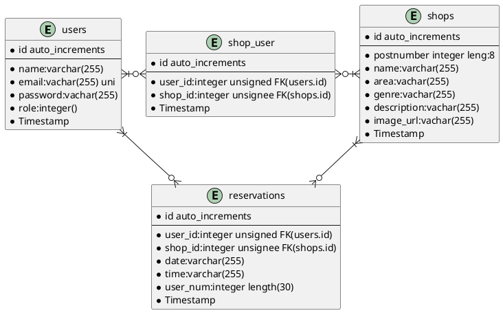

### 要件定義

自社で予約システムを運用する
年間で１万件の予約を予定している。

### 環境

Laravel Framework 8.29.0
mysql 8.0.22

### テーブル定義図　 ER 図

### テーブル定義　ＥＲ図

### リレーション
usersテーブルshopsテーブルで多対多
shop_userテーブルはお気に入り店舗として中間テーブル
reservationは予約情報としての中間テーブル

### API一覧と機能詳細
ユーザと管理者と店舗情報管理者でAPIを大きく切り分け

#### ユーザ用API
##### Route::apiResource('/users', UserController::class)

- store：ユーザ情報を登録
- show:フロントエンドから送信されたJWTを解読しデータベースと照合。テーブルに存在すればユーザ情報と予約情報とお気に入り店舗情報を返す。
リレーションの情報はload()を用いてEager loading。

- index,update,destory：今後の拡張による

##### oute::apiResource('/shops', ShopController::class);

- show:全店舗情報を変えす

- index,store,update,destory:
今後の拡張による

##### Route::get('/login', [LoginController::class, 'get']);
- get:フロントエンドから送信されたJWTを解読し認証許可とユーザIDとrole(権限)を返す。

##### Route::post('/reservation', [ReservationController::class, 'post']);
- post:予約情報を登録する
##### Route::delete('/reservation/{reservation}', [ReservationController::class, 'destroy']);
- destory:予約情報を削除する
#### Route::post('/likes', [LikeController::class, 'post']);
- post:お気に入り店舗を登録する
リレーションがあるためsyncWithoutDetachingを利用して完全重複以外は重複ＯＫで登録

##### Route::delete('/likes', [LikeController::class, 'destroy']);

- destory:お気に入り店舗を削除する。リレーションがあるためdetachで解除

#### 店舗情報管理者用API
##### 共通：ミドルウェアで店舗情報管理権限チェック

##### Route::get('/shopadmin/shops', [ShopAdminController::class, 'index'])->middleware("ShopAdminCheck");

- get:全店舗情報を取得

##### Route::post('/shopadmin/register/shop', [ShopAdminController::class, 'store'])->middleware("ShopAdminCheck");

- post:新規店舗情報作成

##### Route::get('/shopadmin/shops/{shop}', [ShopAdminController::class, 'show'])->middleware("ShopAdminCheck");

- show:店舗情報とその店舗の予約情報を取得
リレーションがあるためloadで取得

##### Route::put('/shopadmin/update/shop', [ShopAdminController::class, 'update'])->middleware("ShopAdminCheck");

- update:店舗情報を更新

##### Route::delete('/shopadmin/delete/shop', [ShopAdminController::class, 'destroy'])->middleware("ShopAdminCheck");

- destroy:店舗情報を削除する。

##### Route::delete('/shopadmin/delete/reservation/{reservation}', [ReservationController::class, 'destroy'])->middleware("ShopAdminCheck");

- destroy:該当店舗の予約情報を削除する。

#### 管理者用API
##### Route::post('/admin/register/shopadmin', [ShopAdminRegisterController::class, 'post'])->middleware("AdminCheck");

- post:店舗管理者を登録する
admin権限のroleがなければミドルウェアでエラーを返す。

