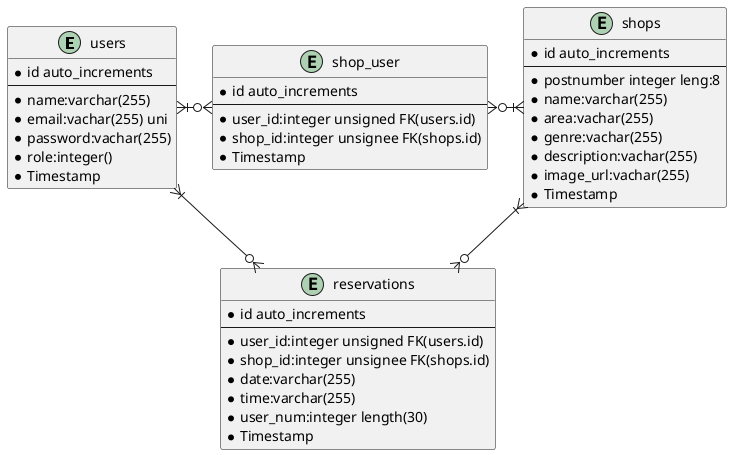

### 環境

Laravel Framework 8.29.0

kreait/firebase-tokens:1.14.0

mysql 8.0.22

### 本番環境と開発環境

masterブランチを本番環境

developブランチを開発環境で使用
開発環境で適宜ブランチを切り開発する

develop→masterへCreate a merge commitで行っている

Branch protection ruleを用いてmasterへの直pushは禁止

### テーブル定義　ＥＲ図

### リレーション
usersテーブルshopsテーブルで多対多
shop_userテーブルはお気に入り店舗として中間テーブル
reservationは予約情報としての中間テーブル

### API一覧と機能詳細
ユーザと管理者と店舗情報管理者でAPIを大きく切り分け

#### ユーザ用API
##### メソッド|URL|action(コントローラー)の順

##### POST| api/users | App\Http\Controllers\UserController@store
##### GET  | api/users/{user}                                 | App\Http\Controllers\UserController@show
- store：ユーザ情報を登録
- show:フロントエンドから送信されたJWTを解読しデータベースと照合。テーブルに存在すればユーザ情報と予約情報とお気に入り店舗情報を返す。
リレーションでload()を用いてEager loading。

- index,update,destory：今後の拡張による

##### GET  | api/shops/{shop}                                  | App\Http\Controllers\ShopController@show
- show:全店舗情報を変えす

- index,store,update,destory:
今後の拡張による

##### GET  | api/login                                                  | App\Http\Controllers\LoginController@get
- get:フロントエンドから送信されたJWTを解読し認証許可とユーザIDとrole(権限)を返す。

##### POST      | api/reservation                                               | App\Http\Controllers\ReservationController@post
- post:予約情報を登録する
##### DELETE    | api/reservation/{reservation}                               | App\Http\Controllers\ReservationController@destroy
- destory:予約情報を削除する
##### POST      | api/likes                                                    | App\Http\Controllers\LikeController@post
- post:お気に入り店舗を登録する
リレーションがあるためsyncWithoutDetachingを利用して完全重複以外は重複ＯＫで登録

##### DELETE    | api/likes                                                 | App\Http\Controllers\LikeController@destroy

- destory:お気に入り店舗を削除する。リレーションがあるためdetachで解除

#### 店舗情報管理者用API
##### 共通：ミドルウェアで店舗情報管理権限チェック

##### GET | api/shopadmin/shops                                           | App\Http\Controllers\ShopAdminController@index

- get:全店舗情報を取得

##### POST      | api/shopadmin/register/shop                                | App\Http\Controllers\ShopAdminController@store

- post:新規店舗情報作成

##### GET  | api/shopadmin/shops/{shop}                                   | App\Http\Controllers\ShopAdminController@show

- show:店舗情報とその店舗の予約情報を取得
リレーションがあるためloadで取得

##### PUT       | api/shopadmin/update/shop                                    | App\Http\Controllers\ShopAdminController@update

- update:店舗情報を更新

##### DELETE| api/shopadmin/delete/shop/{shop}                             | App\Http\Controllers\ShopAdminController@destroy

- destroy:店舗情報を削除する。

##### DELETE    | api/shopadmin/delete/reservation/{reservation}              | App\Http\Controllers\ReservationController@destroy

- destroy:該当店舗の予約情報を削除する。

#### 管理者用API
##### POST      | api/admin/register/shopadmin                                 | App\Http\Controllers\ShopAdminRegisterController@post

- post:店舗管理者を登録する
admin権限がなければミドルウェアでエラーを返す。

